# AWS VPC Network Lab


A hands-on AWS networking project built with **Terraform** to design, provision, secure, and validate a custom Virtual Private Cloud.

This project demonstrates core AWS networking concepts including **VPCs, CIDR planning, public and private subnets, Internet Gateway, route tables, Security Groups, EC2, Nginx, and network connectivity**.

---

## Architecture

```text
                         INTERNET
                            |
                            v
                  +------------------+
                  | Internet Gateway |
                  +--------+---------+
                           |
                    +------v------+
                    |     VPC     |
                    | 10.0.0.0/16 |
                    +------+------+
                           |
              +------------+------------+
              |                         |
       +------v-------+          +------v--------+
       | Public Subnet|          | Private Subnet|
       | 10.0.1.0/24  |          | 10.0.2.0/24   |
       |              |          |               |
       | EC2 + Nginx  |          | No public IP  |
       +--------------+          +---------------+
              |
              v
       Public Route Table
          0.0.0.0/0
              |
              v
      Internet Gateway


## Project Overview

This project demonstrates the design, provisioning, security, and validation of an AWS VPC network using Terraform and AWS CLI. The environment contains a custom VPC, public and private subnets, Internet Gateway, route tables, Security Group, public EC2 instance, and Nginx web server.

## Project Objectives

- Design a custom AWS VPC using CIDR planning
- Create public and private subnets
- Configure an Internet Gateway
- Configure public and private route tables
- Implement Security Group controls
- Deploy an Amazon Linux EC2 instance
- Install and configure Nginx
- Validate infrastructure using AWS CLI
- Test public HTTP connectivity
- Manage infrastructure using Terraform
- Document infrastructure and validation results
- Practice infrastructure cleanup using Terraform

## Network Design

| Component | Configuration |
|---|---|
| VPC | 10.0.0.0/16 |
| Public Subnet | 10.0.1.0/24 |
| Private Subnet | 10.0.2.0/24 |
| Availability Zone | ap-south-1a |
| Public Route | 0.0.0.0/0 to Internet Gateway |
| Public EC2 | Amazon Linux, t3.micro |
| Web Server | Nginx |

The public subnet is intended for resources that require direct internet connectivity. The private subnet does not automatically assign public IP addresses and does not contain a direct Internet Gateway route.

## AWS Infrastructure

### VPC

A custom VPC with CIDR block 10.0.0.0/16 provides the network boundary for the project. DNS support and DNS hostnames are enabled.

### Public Subnet

The public subnet uses 10.0.1.0/24 and enables automatic public IP assignment for launched resources.

### Private Subnet

The private subnet uses 10.0.2.0/24 and disables automatic public IP assignment.

### Internet Gateway

An Internet Gateway is attached to the VPC and provides internet connectivity for resources in subnets whose route tables direct internet traffic to the gateway.

### Route Tables

The public route table contains:

```text
0.0.0.0/0 -> Internet Gateway
```

The private route table contains the VPC local route but does not contain a direct Internet Gateway route.

## Security Design

The public EC2 Security Group allows:

- TCP 22 SSH from the administrator public IP
- TCP 80 HTTP from the internet
- Outbound traffic required by the instance

SSH is restricted to the administrator IP rather than exposing port 22 to the entire internet.

## EC2 and Nginx

A public Amazon Linux EC2 instance is deployed into the public subnet using Terraform.

The EC2 bootstrap process installs Nginx, enables the service, starts the service, and creates a simple web page.

Expected HTTP response:

```text
AWS VPC Network Lab - Public EC2
```

This provides a practical end-to-end validation of the VPC routing and Security Group configuration.

## Terraform Implementation

Terraform is used as the Infrastructure as Code platform for the entire environment.

The deployment workflow is:

```text
Terraform Configuration
        |
        v
terraform init
        |
        v
terraform validate
        |
        v
terraform plan
        |
        v
terraform apply
        |
        v
AWS Infrastructure
        |
        v
AWS CLI Validation
        |
        v
Connectivity Testing
        |
        v
terraform destroy
```

## Repository Structure

```text
aws-vpc-network-lab/
|
+-- terraform/
|   +-- provider.tf
|   +-- variables.tf
|   +-- vpc.tf
|   +-- subnet.tf
|   +-- route.tf
|   +-- security.tf
|   +-- ec2.tf
|   +-- outputs.tf
|
+-- docs/
|   +-- architecture.md
|   +-- screenshots/
|
+-- .gitignore
+-- README.md
```

## Terraform File Responsibilities

| File | Purpose |
|---|---|
| provider.tf | Terraform and AWS provider configuration |
| variables.tf | Project variables and CIDR configuration |
| vpc.tf | VPC creation |
| subnet.tf | Public and private subnet creation |
| route.tf | Internet Gateway and route tables |
| security.tf | Security Group configuration |
| ec2.tf | EC2 instance and Nginx configuration |
| outputs.tf | Terraform infrastructure outputs |

## Deployment Commands

Initialize Terraform:

```bash
terraform init
```

Validate configuration:

```bash
terraform validate
```

Review the deployment plan:

```bash
terraform plan
```

Deploy the infrastructure:

```bash
terraform apply
```

View Terraform outputs:

```bash
terraform output
```

## Validation and Testing

AWS CLI was used to verify the deployed infrastructure.

Useful validation commands include:

```bash
aws ec2 describe-vpcs
aws ec2 describe-subnets
aws ec2 describe-route-tables
aws ec2 describe-internet-gateways
aws ec2 describe-security-groups
aws ec2 describe-instances
```

The project also validates the EC2 networking configuration by checking the instance VPC, subnet, private IP, public IP, and Security Group association.

## HTTP Connectivity Test

The public EC2 instance runs Nginx and can be tested using:

```bash
curl http://<EC2-PUBLIC-IP>
```

Expected response:

```text
AWS VPC Network Lab - Public EC2
```

The connectivity path is:

```text
Internet
   |
   v
Internet Gateway
   |
   v
Public Route Table
   |
   v
Public Subnet
   |
   v
Security Group
   |
   v
EC2
   |
   v
Nginx
```

## Terraform Outputs

The project exposes important infrastructure information through Terraform outputs, including:

- VPC ID
- VPC CIDR
- Public subnet ID
- Private subnet ID
- Internet Gateway ID
- Public route table ID
- Private route table ID
- Security Group ID
- EC2 instance ID
- EC2 private IP
- EC2 public IP

Resource IDs and IP addresses are intentionally not hardcoded into this README because they are environment-specific.

## Screenshots

The repository contains screenshots documenting the major infrastructure milestones.

### VPC

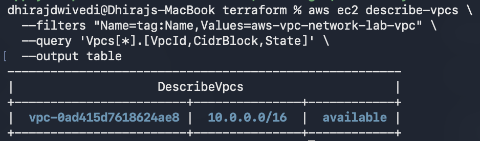

### Public Subnet

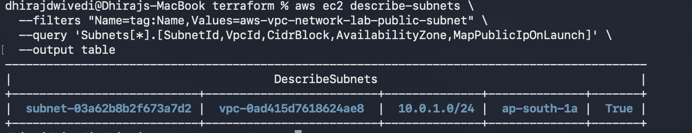

### Public vs Private Subnets

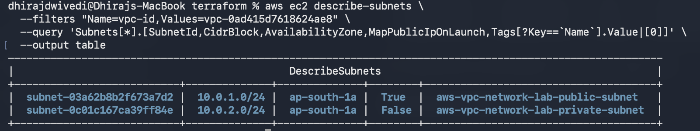

### Internet Gateway

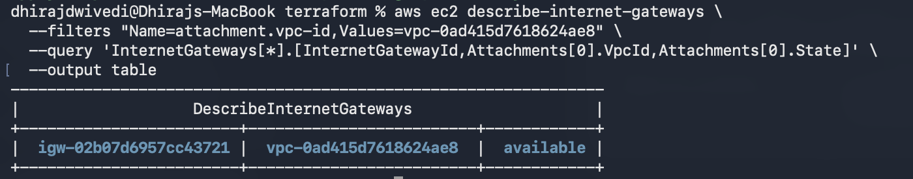

### Public Route Table

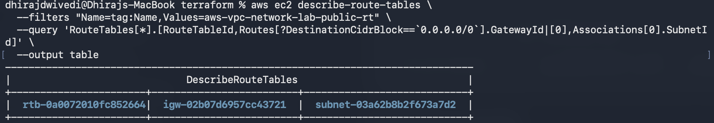

### Private Route Table

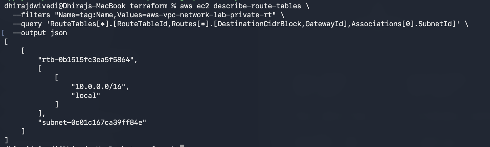

### Security Group

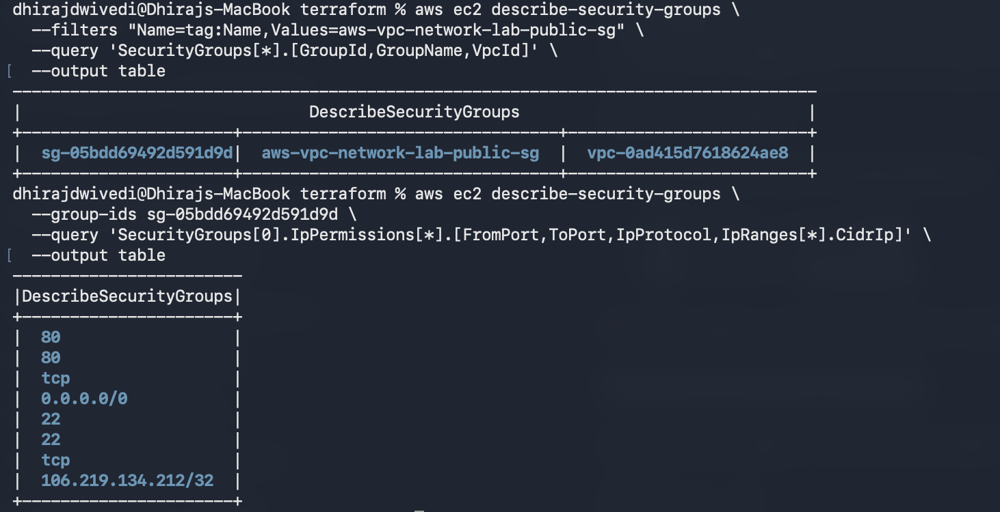

### EC2 Instance

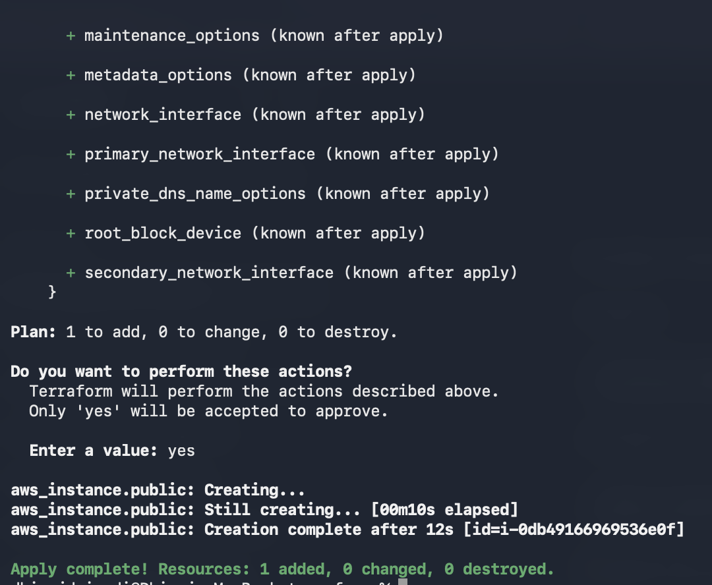

### EC2 Network Details

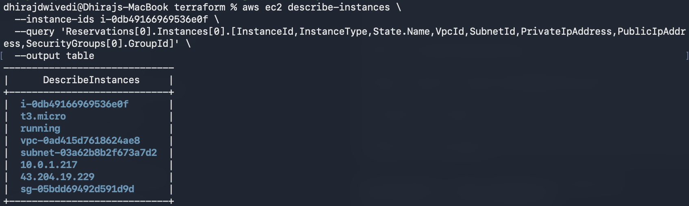

### HTTP Connectivity

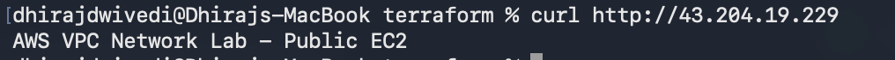

### Terraform Outputs

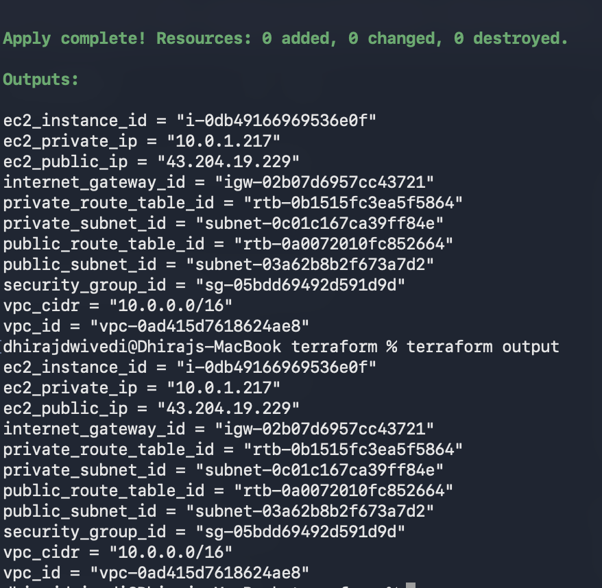

## Design Decisions

### Custom VPC

A custom VPC was used to demonstrate the underlying AWS networking components instead of relying on a default VPC.

### Public and Private Subnets

Separate subnets demonstrate the difference between internet-facing and non-public network tiers.

### No NAT Gateway

NAT Gateway was intentionally excluded from this short project because it can introduce additional AWS charges. It can be added later when private resources require controlled outbound internet access.

### Terraform

Terraform provides repeatable infrastructure, version-controlled configuration, declarative resource management, and easier infrastructure recreation.

## Security Considerations

The project follows basic security practices:

- SSH access is restricted to the administrator IP
- HTTP is opened only for the web-server demonstration
- The private subnet does not automatically receive public IP addresses
- Terraform state files are excluded from Git
- Private keys are excluded from Git
- Environment-specific IP addresses are not hardcoded into documentation

Production environments could additionally use IAM least privilege, AWS Systems Manager Session Manager, VPC Flow Logs, CloudTrail, private endpoints, centralized monitoring, and Multi-AZ architecture.

## Cost Considerations

The project intentionally avoids NAT Gateway, Application Load Balancer, RDS, and EKS to keep the lab small and reduce potential AWS costs.

VPC networking components such as VPCs, subnets, route tables, and Internet Gateways generally do not have separate hourly charges. EC2 costs depend on the AWS account eligibility and applicable current AWS pricing.

Always review current AWS pricing before deploying chargeable resources.

## Troubleshooting and Lessons Learned

### Terraform Provider Dependencies

The Security Group uses the Terraform HTTP provider to determine the administrator public IP address. The provider must be declared and initialized before Terraform can evaluate that configuration.

### Terraform Outputs

Terraform outputs become available in the state after the configuration is successfully applied. After modifying outputs, Terraform must be applied again before using terraform output to retrieve the updated values.

### SSH IP Changes

If the administrator public IP changes, the SSH Security Group rule may need to be updated before SSH access works again.

## Skills Demonstrated

### AWS

- Amazon VPC
- Subnetting
- CIDR addressing
- Internet Gateway
- Route Tables
- Security Groups
- EC2
- Amazon Linux
- AWS Systems Manager Parameter Store
- AWS CLI

### Infrastructure as Code

- Terraform
- Terraform providers
- Terraform variables
- Terraform resources
- Terraform outputs
- Terraform state
- Terraform validation
- Terraform planning

### Linux

- Package management
- Nginx installation
- systemd service management
- Network testing
- Linux command-line administration

### DevOps

- Infrastructure as Code
- Git
- GitHub
- Infrastructure documentation
- Project tracking
- Troubleshooting
- Cost-aware infrastructure design

## Future Enhancements

Possible future improvements include:

- Multi-AZ architecture
- NAT Gateway
- Application Load Balancer
- Auto Scaling
- VPC Flow Logs
- CloudWatch monitoring
- AWS Systems Manager
- Terraform modules
- Remote Terraform state
- GitHub Actions CI/CD
- Private EC2 instances
- SSM-based administration
- Network ACL implementation

These features are outside the scope of the current short VPC networking lab.

## Cleanup

After completing the lab, destroy the AWS infrastructure to avoid unnecessary charges:

```bash
terraform destroy
```

Confirm the destruction when Terraform asks for approval.

Then verify the Terraform state:

```bash
terraform state list
```

The GitHub repository and documentation remain intact because Terraform destroy removes AWS infrastructure managed by Terraform, not the GitHub repository.

## GitHub Project

The project is tracked using GitHub Projects.

**Project:** AWS VPC Network Lab

**Project Number:** 5

## Repository

**GitHub:** DhirajCloud/aws-vpc-network-lab

## Professional Project Summary

AWS VPC Network Lab is a Terraform-based AWS networking project demonstrating practical cloud infrastructure and DevOps capabilities.

The project provisions a custom VPC with public and private subnets, Internet Gateway, route tables, Security Group controls, and a public EC2 web server running Nginx.

Infrastructure is deployed through Terraform and validated using AWS CLI commands and HTTP connectivity testing.

### Core Technologies

**AWS VPC | Terraform | AWS CLI | EC2 | Linux | Nginx | Git | GitHub | Infrastructure as Code | Cloud Networking | Security**

## Author

**Dhiraj Dwivedi**

Cloud / DevOps Engineer

GitHub: **DhirajCloud**

## License

This project is intended for educational, portfolio, and demonstration purposes.
